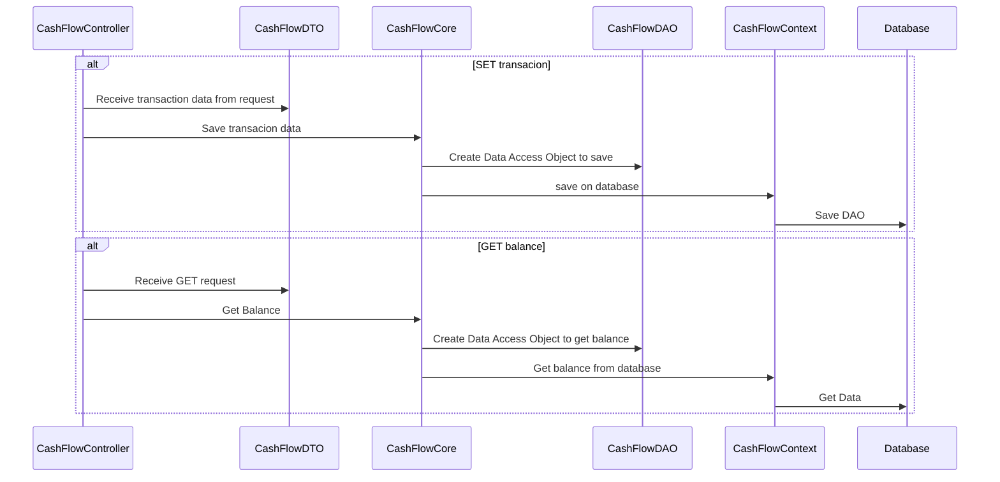

# Objective
This project aims to help a merchant who needs to record the daily cash flow of their business. The entries will consist of Debits and Credits. The merchant also needs a report with a consolidated daily balance.

# Assumptions
- The backend of the application has been developed, exposing an API with two endpoints.
- Due to the simplicity of the scope, it wasn't necessary to use RESTFul with all the REST verbs.
- Hexagonal architecture was used, with Ports and Adapters.
- DDD was used to separate the use case and keep the domain explicit for better understanding.
- Most of the validations and exception handling have been suppressed.
- Automated tests have been suppressed.
- Developed with C#, .NET 7, Entity Framework, and SQLite

# Prerequisites
- Docker installed

# How to Run
1. Execute the command below to create the application image:
```bash
docker build . -f ".\Dockerfile" --force-rm -t vinicius/apiefsqlite
```
2.  Execute the command below to create the container and launch the application:
```bash
docker run -dt -P --name API_EF_SQLite -p 32700:80 vinicius/apiefsqlite -c "dotnet API_EF_SQLite.dll"
```
3.  Open the link below to open the swagger interface:
```bash
http://localhost:32700/swagger/index.html
```

## Sequence Diagrams
